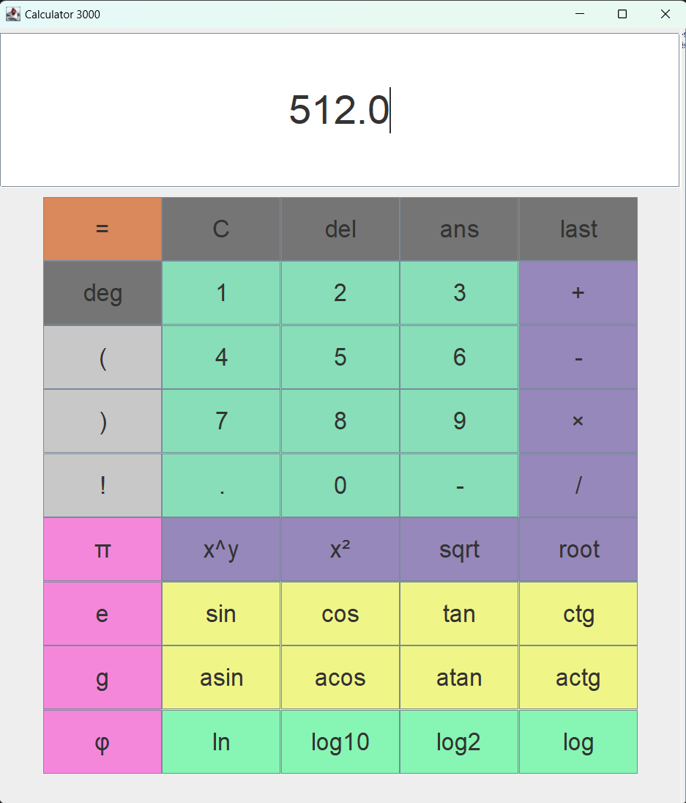

# GUI calculator in Java

## Dependencies

- [**Swing** for GUI ](https://docs.oracle.com/javase%2F7%2Fdocs%2Fapi%2F%2F/javax/swing/package-summary.html)
- [**mxParser** for math [v5.2.1 of 2023-02-08]](https://github.com/mariuszgromada/MathParser.org-mXparser)

## Functionality

- Basic arithmetic operations
- Basic trigonometric functions
- Constants
- "Answer" button
- History panel
- Adjustable and scalable GUI
- Both GUI and Keyboard input support

## Screenshots

## Development context

A fully functioning prototype was developed in November 2023 as a part of IB DP 1 Computer Science course in Letovo, Moscow. This version has not been updated since 2023.11.18